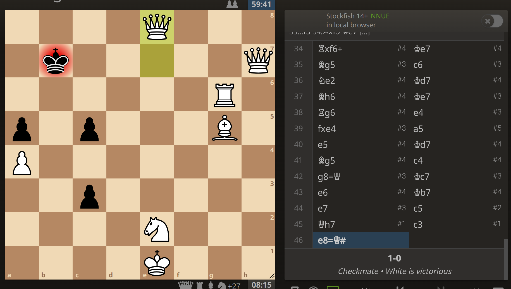

# chess

This is a very bad chess bot I wrote in a few days, after getting inspiration from Neal Agarwal's [password game](https://neal.fun/password-game/). I didn't look anything up, so it's a simple materiel advantage lookahead with no hash table and no pruning. [Jonathan Gordon](https://www.linkedin.com/in/jonathan-a-gordon/) contributed the piece weights, my initial guesses were Queen 25, Knight 10, Bishop 7, Rook 5, Pawn 1.

The config.yml can be pasted into a [lichess-bot](https://github.com/lichess-bot-devs/lichess-bot) repo to hook it up to lichess, I have a bot account [here](https://lichess.org/@/nilesrogoff_chessbot) but I'm not going to leave it running all the time as it's on my laptop.

It beat [sargon-2ply](https://lichess.org/rnLCRDqW0iG0) once, so that's something. sargon-2ply was running on a raspberry pi and only used 19 seconds of its time, while `chess` used ~52 minutes at full throttle, but hey it's still a victory.

Other engines have "Nodes/second" listed as some sort of performance metric, I'm not sure exactly what that measures, but I can count the number of outer loop iterations in `engine`, which comes out to ~6M moves/minute using all 4 cores on my laptop. This is probably way higher than whatever the actual "nodes/second" measures as other chess engines with lower values seem to perform much better.
